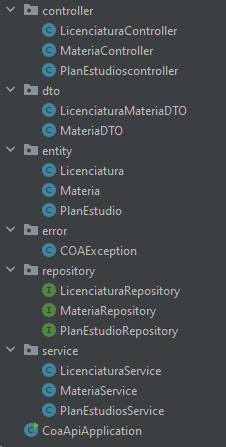
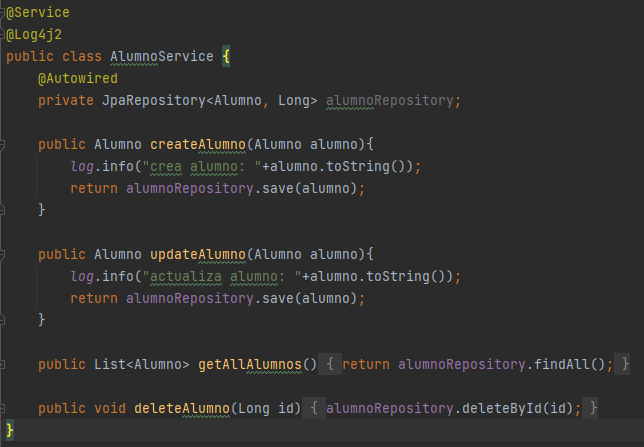
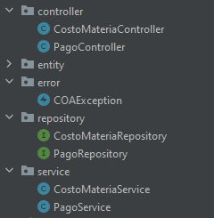

# SOLID Principles in Spring Boot
The Spring Boot Framework, including its architecture, makes use of software development best practices, and between them, it also uses and applies the following SOLID principles:

### Single Responsibility Principle (SRP)
Single-responsibility Principle (SRP) states that a class should have only one job and responsibility, and because of that, only one reason to change.

In this project, it reflects the use of this principle from its structure, classifying each class and each package depending on its use, and even naming them depending on their use (which by the way is also a good software development practice, in the sense that you can get an idea of how a class works just by reading its name).



> Structure of the *coa-api* microservice, where each package has its own responsibility.

As you can see, both of packages and classes have their own responsibility, for example, the class *Licenciatura* from the *entity* package:
```java
@Entity
@Table(name ="licenciaturas")
@Data
@NoArgsConstructor
public class Licenciatura {
    @Id
    @Column(name ="id")
    @GeneratedValue(strategy = GenerationType.SEQUENCE, generator = "licenciatura_seq")
    @SequenceGenerator(name = "licenciatura_seq", sequenceName = "licenciatura_seq", initialValue = 1, allocationSize = 1)
    private Long id;
    @Column(name ="revoe")
    private String revoe;
    @Column(name  ="nombre")
    private String nombre;
    @OneToMany(fetch = FetchType.LAZY, mappedBy = "licenciatura")
    @ToString.Exclude
    @JsonIgnore
    private List<PlanEstudio> planEstudios;
}
```
This class has the unique responsibility of defining the model of *licenciatura*, the way its data will be represented in the database with its atributes.

### Open/Closed Principle (OCP)
Open/Closed Principle (OCP) states that a class or module should be open to extension and closed to modification, which means, if a class that exists is already used, we shouldn't touch the code that already exists, on the other hand, we shouldn't have any problems by adding new features or code without modifying the original code.

In the case of the project, it has the package of *repository*, where its intefaces are responsable for making the connection and doing the operations to the database, obviously depending of the class is the table that will be affected.

One example of these interfaces is the following interface, *LicenciaturaRepository*, and as the name suggests, is the interface responsable of making the operations to the licenciatura's table, specifically, SQL operations.

Between these SQL operations from the *JpaRepository* interface, we have the typical CRUD operations, but what makes different these implementation (and this is where the **OCP** principle is present), is that, without having to modify the original code from the *JpaRepository* interface, we can add custom methods, and even with SQL statements, complying with the **OCP**, where this *LicenciaturaRepository* is closed for modification, but open for changes.

```java
public interface LicenciaturaRepository extends JpaRepository <Licenciatura, Long> {
    Optional<Licenciatura> findByRevoe(String revoe);

    Licenciatura findByNombreAndRevoe (String nombre, String revoe);

    @Query("select l from Licenciatura l where l.nombre = :param")
    List<Licenciatura> findByOtherParams (@Param("param") String param);
}
```
### Liskov Substitution Principle (LSP)
Liskov Substitution Principle (LSP) states that every derived class should be substitutable for their base class, in the sense that the derived class should have the same functionality of its base class, without modifying or overwriting the behavior of a method from its base class.

To explain this principle, we can use something similar as the previous example:
```java
public interface AlumnoRepository extends JpaRepository<Alumno, Long> {
}
```
Here we have an interface called *AlumnoRepository* that extends the *JpaRepository* interface. The way in which this interface can comply the **LSP**, is replacing it with its base interface, in this case, *JpaRepository*, and the behaviour of the program shouldn't changed.

The class that uses the *AlumnoRepository* interface is the *AlumnoService* class, responsable for process and handle HTTP requests, so it should change from this:
```java
@Service
@Log4j2
public class AlumnoService {
    @Autowired
    private AlumnoRepository alumnoRepository;

    public Alumno createAlumno(Alumno alumno){
        log.info("crea alumno: "+alumno.toString());
        return alumnoRepository.save(alumno);
    }

    public Alumno updateAlumno(Alumno alumno){
        log.info("actualiza alumno: "+alumno.toString());
        return alumnoRepository.save(alumno);
    }

    public List<Alumno> getAllAlumnos(){
        return alumnoRepository.findAll();
    }

    public void deleteAlumno(Long id){
        alumnoRepository.deleteById(id);
    }
}
```
To this:



The *JpaRepository* in this case needs the class to be mapped and the data type that is its respective primary key. Aside from that, and thanks to the IntelliJ IDE, we can see that it doesn't cause any errors, and eventually, it shouldn't give any errors when running either.

### Interface Segregation Principle (ISP)
Interface Segregation Principle (ISP) states that many client-specific interfaces are better than one general-purpose interface, keeping it separate and organized.

In the project we have two examples that have already been explained. 

First, the structure of the project evidences the use of this principle, due to the fact of having different classes separately with different purposes each one. For example, in the case of the *sie-api* microservice, as the previous examples, also has the same structure:



Obviously one really bad practice would be have all the CRUD operations (including the connection to the database and processing the HTTP requests) in one class, and with it, breaking the ISP.

On the other hand, being more specifically, it would be another bad practice to have all the methods that process the HTTP requests in one class, like *SieApiController*, including both *Pago* and *CostoMateria* methods. That's why it's separated in two different classes, in the way that the *CostoMateriaController* only focuses in processing the HTTP requests of *CostoMateria*, and *PagoController* processing the HTTP requests of *Pago*, instead of having both in one class.

### Dependency Inversion Principle (DIP)
Finally, the dependency Inversion Principle (DIP) states that high-level modules should not depend on low-level modules, but both should depend on abstractions. This means that the code should depend on abstractions, not on concrete implementations.

Let's explain this principle with the *'escolar'* microservice of the project:

```java
@Service
@Log4j2
public class KardexService {
    @Autowired
    private Environment env;
    @Autowired
    private KardexRepository kardexRepository;

    @Autowired(required=true)
    private IPlanEstudiosClient planEstudiosClient;
```
In this class, *KardexService* depends on the abstraction KardexRepository through dependency injection using the *@Autowired* annotation.

On the other hand, we have the *IPlanEstudiosClient* interface:
```java
@FeignClient(name = "coa-api", path = "/coa-api/plan-estudios", url = "")
public interface IPlanEstudiosClient {

    @GetMapping(value = ("/{licenciatura-id}"))
    ResponseEntity<LicenciaturaMateriaDTO> findByLicenciaturaId(@PathVariable(value = "licenciatura-id") long licenciatruaId);
}
```

This interface uses an abstraction for a Feign client used to consume an external service, in this case, the *'coe-api'* microservice and its class, *PlanEstudios*. In this way, the interface *IPlanEstudiosClient* follows the principle of defining an abstraction for communication with external services, or in this case, with another microservice.